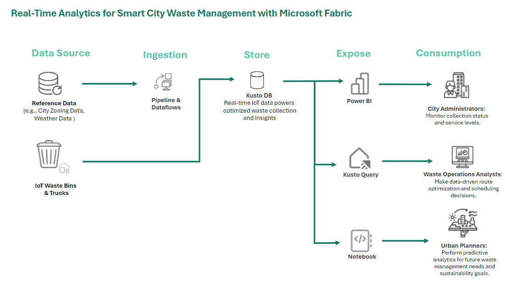

# Smart City Monitoring with Microsoft Fabric

Welcome to the Smart City Monitoring repository! This project leverages Microsoft Fabric to provide real-time analytics for urban infrastructure monitoring, focusing on waste management and water quality management as initial use cases.

## Use Cases

### 1. Waste Management
The waste management solution aims to optimize waste collection routes, monitor service levels, and support long-term urban planning. This is achieved by leveraging IoT sensors in waste bins and collection trucks, with data stored in Kusto DB. The analytics provide actionable insights for city administrators, waste operations analysts, and urban planners.

#### Architecture Overview

**Data Pipeline:**
- **Data Sources**: IoT sensors in waste bins and trucks, along with city reference data (e.g., zoning and weather).
- **Ingestion**: Data flows through pipelines and dataflows to Kusto DB for storage.
- **Storage**: Real-time data is stored in **Kusto DB**, enabling efficient querying and analytics.
- **Exposure & Consumption**:
  - **Power BI**: Offers dashboards for city administrators to monitor collection status and service levels.
  - **Kusto Query**: Provides detailed query access for waste operations analysts to optimize collection routes and schedules.
  - **Notebooks**: Used by urban planners for predictive analysis, helping forecast future waste management needs.

### 2. Water Quality Management 
The water quality management use case aims to provide real-time monitoring of water quality indicators across the city, ensuring regulatory compliance and public safety. This module will use a similar architecture, with data ingestion, storage, and exposure via Kusto DB, Power BI, and notebooks.

## Repository Structure

Here’s an overview of the folder structure and contents created by Microsoft Fabric:

- **`/AnomalyDetection.Notebook`**: Contains notebooks for detecting anomalies in the data, possibly identifying irregular patterns in waste or water quality metrics.
  
- **`/DataGenerationWaterQuality.Notebook`**: Notebooks for synthetic data generation related to water quality, useful for testing models and analytics.
  
- **`/Optimized Waste Collection Route Visualization.Notebook`**: Contains visualizations for optimizing waste collection routes based on the data insights.

- **`/SilverLayer.Lakehouse` and `/bronze.Lakehouse`**: These folders contain datasets organized by Lakehouse layers. The Bronze layer stores raw data, while the Silver layer holds cleansed and transformed data.

- **`/Smart City Real-Time Waste Management Dashboard`**: Includes configurations and assets for the Power BI dashboards designed for waste management use cases.

- **`/images`**: Contains image assets, such as architecture diagrams, to be used in documentation.

- **`/lakehouse_optimization_[unique_id]`**: Files related to optimization processes for data storage and query efficiency within the lakehouse environment.

- **`/smartcitywastedata-queryset.KQLQueryset`** and **`/smartcitywasterflow-eh_queryset.KQLQueryset`**: Kusto Query Language (KQL) files that define queries for analyzing waste data.

- **`/waterQuality.Report`** and **`/waterQuality.SemanticModel`**: Files related to water quality reporting and semantic models, supporting analytics and reporting functions.

- **`/waterQualityKQL_queryset.KQLQueryset`**: KQL files specific to water quality queries for monitoring and analysis.

This structure ensures each module is organized and directly accessible within Fabric.

## Getting Started
1. **Prerequisites**:
   - Access to Microsoft Fabric workspace.
   - A GitHub Personal Access Token (classic) to connect to the Fabric workspace repository.

2. **Setup**:
   - Clone this repository.
   - Follow the instructions in `/docs/setup.md` to set up your local environment.
   - Use the `.env.template` file for required environment variables.

3. **Deployment**:
   - After setup, use Microsoft Fabric’s pipelines to automate data ingestion and processing.
   - Deploy Power BI dashboards for waste management and configure Kusto DB for real-time analytics.

## Future Work
- **Enhancements** to the waste management analytics, such as incorporating predictive models for demand forecasting.
- **Expansion** into additional smart city use cases, starting with water quality management.
